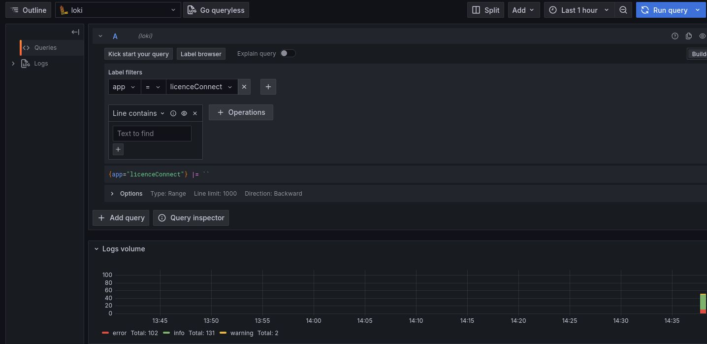

# Licence Connect Core Application
## Introduction and Goals

Licence Connect enables schools, school boards, and federal German states to manage educational resources by buying them, assigning them, and making them available to users at schools.

Licence Connect Core provides a way of accessing licences in a unified way.

## Table of Contents

- [Setup](#setup)
  - [Prerequisites](#prerequisites)
  - [Environment Variables](#environment-variables)
  - [Building the Project](#building-the-project)
  - [Running the Application](#running-the-application)
  - [Running Tests](#running-tests)
  - [Docker Deployment](#docker-deployment)
- [License](#license)

## Setup

### Prerequisites

- Java 21
- Maven 3.x
- Docker (optional, for containerized deployment)

### Environment Variables

The application requires several environment variables to be set for proper configuration. These variables are used to populate the `application.properties` file.

- `BILO_V1_PASSWORD`: Password for the Bilo V1 admin user with which licenceconnect authenticates its requests to BildungsLogin V1.
- `BILO_V2_CLIENT_ID`: Client ID with which licenceconnect authenticates its requests to BildungsLogin V2.
- `BILO_V2_CLIENT_SECRET`: Client secret with which licenceconnect authenticates its requests to BildungsLogin V2.
- `VIDIS_API_KEY`: Unprivileged API Key with which VIDIS can authenticate its requests for licence retrieval.
- `VIDIS_API_KEY_ADMIN`: Admin API Key with which VIDIS can authenticate its requests for adding, removing and retrieving allowed licence holding systems for clients based on the client name.
- `H2_DB_USER`: Username for the H2 database.
- `H2_DB_USER_PASSWORD`: Password for the H2 database.
- `GF_AUTH_ANONYMOUS_ENABLED`: Allows access for unauthenticated users to the grafana dashboard if set to `true`, defaults to `false`
- `GF_AUTH_ANONYMOUS_ORG_ROLE` Sets unauthenticated users as `Admin`, defaults to `Viewer`

optional:
- `DB_FILE_PATH`: Path to the H2 database file. Default is `./docker/db`. Make sure to set the right permissions (see Docker section).

optional:
- `DB_FILE_PATH`: Path to the H2 database file. Default is `./docker/db`. Make sure to set the right permissions (see Docker section).

You need to have all the Environment Variables set before running any of the following commands which can be done either by setting them in the environment or by passing them as arguments to the maven command as shown below:

```sh
BILO_V1_PASSWORD=<admin password> VIDIS_API_KEY=<unprivileged key> VIDIS_API_KEY_ADMIN=<admin key> BILO_V2_CLIENT_ID=<bilo client id> BILO_V2_CLIENT_SECRET=<bilo secret> H2_DB_USER=<db user> H2_DB_USER_PASSWORD=<db password> <COMMAND>
```

### Building the Project

To build the project, run the following command:

```sh
mvn clean install
```

### Active Profiles

Several profiles allow for different configurations of the application. The following profiles are available:
- `auto-start-mocks`: Automatically starts the dockerized mock-servers
- `local`: Configures the application to query against the local mock servers
If the profile is set to `auto-start-mocks` when running the application (e.g. `mvn test -Dspring.profiles.active=auto-start-mocks`, the mock servers will be started automatically.

### Running the Application

To run the application, use the following command:

```sh
mvn spring-boot:run
```

On local development, the swagger UI can be accessed at `http://localhost:8080/swagger-ui/index.html`

### Running Tests

To run the tests, use the following command:

```sh
mvn test
```

### Docker

To build the Docker image locally, use the following command:

```sh
./mvnw spring-boot:build-image -DskipTests
```

Before running docker, make sure to change the ownership of the db folder to the user running the docker container. This is necessary because the docker container runs as a different user and needs write access to the db folder.
```sh
sudo chown -R 1002:1000 ${DB_FILE_PATH} # default is ./docker/db
```

To run the Docker image locally, use the following command:
```sh
docker run -e BILO_V1_PASSWORD=<password> -e BILO_V2_CLIENT_ID=<client_id> -e BILO_V2_CLIENT_SECRET=<client_secret> -e VIDIS_API_KEY=<unprivileged_key> -e VIDIS_API_KEY_ADMIN=<admin_key> -e H2_DB_USER=<db user> -e H2_DB_USER_PASSWORD=<db password> -p 8080:8080 lc-core:latest
```
or use the provided downup.sh script:
```sh
./downup.sh 
```

CAUTION: Docker in rootless mode does not seem to work with the spring-boot:build-image command.

#### Logging

When running in docker, it is possible to store logs in loki and display them with grafana.
To configure grafana to use loki, enter the following link: http://localhost:3000/connections/add-new-connection
choose loki as the data source and enter the following URL into the field connection->url: http://loki:3100
Then, you can query the logs in the explore tab like so: 

The Grafana container is only started for the `debug` docker service profile, i.e. when you start the docker compose project with either the `--profile=debug` argument,
or supply the `COMPOSE_PROFILES=debug` variable either directly before the command or via the environment. On the deployment-VM, the Grafana container should not run,
as instead an existing Grafana instance will use the Loki container as a data source.

### Deployment

The app is deployed for every push to the `main` branch.
It is deployed onto the `licence-connect-api.fwu.nhnbg` VM, which can be reached via the VPN provided by Netz-Haut GmbH for the FWU. The user used to deploy and run the app is `docker`, whose home directory on the VM is `/var/docker`. The app resides in `/var/docker/apps/licenceconnect`

Externally, the app can be reached via `https://api.licenceconnect.schule/`, with a publicly available swagger UI on `https://api.licenceconnect.schule/swagger`.

The exact deployment process can be seen inside `.gitlab-ci.yml`, but essentially, the pipeline
- builds a new docker image
- copies the `docker/docker-compose.yaml` file and the `docker/nginx` directory to the VM
- restarts the docker services

On the server, instead of providing the environment variables directly to the docker compose command, there is an `.env` file located in the app folder in which all required environment variables must be set.

## Mock Licence Servers

To allow easy local testing and testing without being dependent on the availability of external systems, we provide a mock for every licence server we support in `src/mock-licence-servers`.
Currently, this includes:
- Arix
- Bildungslogin V1
- Bildungslogin V2

All licence servers can be individually started in a docker container. All licence servers can be started simultaneously by running `docker-compose up` in `src/mock-licence-servers`.

### Arix

There are two versions of Arix mock servers:
- `arix-accepting` to allow testing the connection to an Arix server that has whitelisted lc core.
- `arix-rejecting` to allow testing the connection to an Arix server that has not whitelisted lc core.

Please be aware that neither is a complete Arix server but rather only provides the functionality needed for the tests currently implemented.

## License

This project is licensed under the Apache License 2.0 - see the `LICENSE` file for details.
