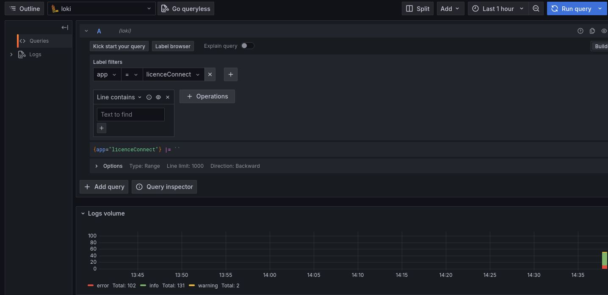

# Licence Connect Core Application

## Table of Contents

- [Introduction and Goals](#introduction-and-goals)
- [Documentation](#documentation)
- [Setup](#setup)
  - [Prerequisites](#prerequisites)
  - [Environment Variables](#environment-variables)
  - [Building the Project](#building-the-project)
  - [Active Profiles](#active-profiles)
  - [Running the Application](#running-the-application)
  - [Running Tests](#running-tests)
  - [Docker Deployment](#docker-deployment)
- [License](#license)

## Introduction and Goals

Licence Connect enables schools, school boards, and federal German states to manage educational resources by buying them, assigning them, and making them available to users at schools.

Licence Connect Core provides a way of accessing licences in a unified way.

## Documentation

The documentation on Licence Connect consists of the following artifacts:

Artifact | Where to Find | Purpose
-------- | -------- | --------
Readme   | Top-level folder in Licence Connect repository (here) | Basic information on the project, instructions for dev setup
Architectural Documentation | doc folder in Licence Connect repository | Architectural documentation containing relevant knowledge for decisions and active development, following the arc42 template
BMI (Bildungsmedieninfrastruktur) Docs | Source: https://github.com/FWU-DE/bmi-docs, <br/> Deployed: https://fwu-de.github.io/bmi-docs/ | Public consumer documentation of licence connect with focus on purpose, features and APIs

## API Setup

This chapter describes the setup of the licence connect core api located in `api/`.
Run the following commands in that directory, e.g. by running:

```sh
cd api
```

### Prerequisites

Prerequisite | Purpose | Notes
------------ | ------- | -----
bun | dev scripts | 
Java 21      | LC Core Development |
Docker & Docker Compose | Running dependencies, building for production | 
Python 3 | Development of LC Halt & mock licence servers |
virtualenv | Development of LC Halt & mock licence servers | 

### Environment Variables

The application requires several environment variables to be set for proper configuration.
Inside the root folder, there is an `.env.example` file containing all possible (required and optional) variables as well as some explanatory comments.
This file should be used as a template for the actual .env file.
All environment variables must be set before running any local mvn commands or trying to run the app without docker.

### Building the Project

To build the project, run the following command:

```sh
./mvnw clean install
```

### Active Profiles

Several profiles allow for different configurations of the application. The following profiles are available:
- `auto-start-mocks`: Automatically starts the dockerized mock-servers
- `local`: Configures the application to query against the local mock servers
If the profile is set to `auto-start-mocks` when running the application (e.g. `mvn test -Dspring.profiles.active=auto-start-mocks`, the mock servers will be started automatically.

### Running the Application

#### Command Line

To run the application from the command line, use the following command:

```sh
(set -a && source ../.env && set +a && ./mvnw spring-boot:run -Dspring.profiles.active=dev)
```

#### IntelliJ IDEA

When using IntellIJ, a run configuration called `LcCoreApplication` should be available.
Running that already uses the correct dev profile and `.env` file.

#### SwaggerUI

On local development, the swagger UI can be accessed at `http://localhost:8080/swagger-ui/index.html`

### Running Tests

To run the tests using the [mock licence servers](#mock-licence-servers) run:

```sh
./mvnw test -Dspring.profiles.active=auto-start-mocks,local
```

To run the tests against external systems run:

```sh
(set -a && source ../.env && set +a && ./mvnw test)
```

### Docker

To build the Docker image locally, use the following command:

```sh
./mvnw spring-boot:build-image -DskipTests
```

Before running docker, make sure to change the ownership of the db folder to the user running the docker container. This is necessary because the docker container runs as a different user and needs write access to the db folder.
```sh
sudo chown -R 1002:1000 ${DB_FILE_PATH} # default is ./docker/db
```

To run the Docker image locally, use the following command:
```sh
docker run -e BILO_V1_PASSWORD=<password> -e BILO_V2_CLIENT_ID=<client_id> -e BILO_V2_CLIENT_SECRET=<client_secret> -e VIDIS_API_KEY=<unprivileged_key> -e API_KEY_ADMIN=<admin_key> -e H2_DB_USER=<db user> -e H2_DB_USER_PASSWORD=<db password> -p 8080:8080 lc-core:latest
```
or use the provided downup.sh script:
```sh
./downup.sh 
```

CAUTION: Docker in rootless mode does not seem to work with the spring-boot:build-image command.

#### Logging

When running in docker, it is possible to store logs in loki and display them with grafana.
To configure grafana to use loki, enter the following link: http://localhost:3000/connections/add-new-connection
choose loki as the data source and enter the following URL into the field connection->url: http://loki:3100
Then, you can query the logs in the explore tab like so: 

The Grafana container is only started for the `debug` docker service profile, i.e. when you start the docker compose project with either the `--profile=debug` argument,
or supply the `COMPOSE_PROFILES=debug` variable either directly before the command or via the environment. On the deployment-VM, the Grafana container should not run,
as instead an existing Grafana instance will use the Loki container as a data source.

### Deployment

The app is deployed for every push to the `main` branch.
It is deployed onto the `licence-connect-api.fwu.nhnbg` VM, which can be reached via the VPN provided by Netz-Haut GmbH for the FWU. The user used to deploy and run the app is `docker`, whose home directory on the VM is `/var/docker`. The app resides in `/var/docker/apps/licenceconnect`

Externally, the app can be reached via `https://api.licenceconnect.schule/`, with a publicly available swagger UI on `https://api.licenceconnect.schule/swagger`.

The exact deployment process can be seen inside `.gitlab-ci.yml`, but essentially, the pipeline
- builds a new docker image
- copies the `docker/docker-compose.yaml` file and the `docker/nginx` directory to the VM
- restarts the docker services

On the server, instead of providing the environment variables directly to the docker compose command, there is an `.env` file located in the app folder in which all required environment variables must be set.

### Rendering the Architectural Documentation

The architectural documentation and it's diagrams can be rendered using either:

* VSCode with the [AsciiDoc](https://marketplace.visualstudio.com/items?itemName=asciidoctor.asciidoctor-vscode) extension and kroki enabled 
(this is also recommended in the repo settings)
* IntelliJ (Kroki needs to be enabled manually)

## Mock Licence Servers

To allow easy local testing and testing without being dependent on the availability of external systems, we provide a mock for every licence server we support in `mock-licence-servers`.
Currently, this includes:
- Arix
- Bildungslogin V1
- Bildungslogin V2

All licence servers can be individually started in a docker container. 
All licence servers can be started simultaneously by running 

```sh
docker compose -f mock-licence-servers/docker-compose.yml up -d
```

### Arix

There are two versions of Arix mock servers:
- `arix-accepting` to allow testing the connection to an Arix server that has whitelisted lc core.
- `arix-rejecting` to allow testing the connection to an Arix server that has not whitelisted lc core.

Please be aware that neither is a complete Arix server but rather only provides the functionality needed for the tests currently implemented.

## License

This project is licensed under the Apache License 2.0 - see the `LICENSE` file for details.

## Bildungslogin Information

The BiLo endpoints reference licence endpoints from "Bildungslogin".
The github of the Bildungslogin public API can be found under https://github.com/BILDUNGSLOGIN/public_api_docs and is licensed with https://github.com/BILDUNGSLOGIN/public_api_docs/blob/main/LICENSE.txt.

In the Licence Connect public API
- the bilo-v-1-controller references https://github.com/BILDUNGSLOGIN/public_api_docs/blob/main/bilo-licenseretrieval_v1.json
- the bilo-v-2-controller references https://github.com/BILDUNGSLOGIN/public_api_docs/blob/main/bilo-licenseretrieval_v2.json
